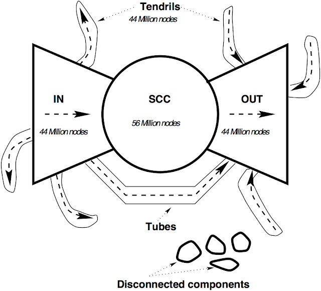

```{r setup, include=FALSE}
knitr::opts_chunk$set(cache=FALSE, fig.align='center', message = FALSE)
library(tidyverse)
library(igraph)
library(ggraph)
library(networkD3)
```

L'obiettivo della seguente analisi è di riassumere ed analizzare i pattern osservati nel mercato calcistico dall'introduzione del cosiddetto **Fair play finanziario** ad oggi. Tale sistema nelle intenzioni avrebbe dovuto ridurre gli effetti delle disparità economiche tra le differenti società evitando così il monopolio "competitivo" di poche squadre. Tuttavia l'impressione è che in realtà la forbice tra le società più ricche e quelle meno ricche si stia allargando sia in termini competitivi che in termini economici.

## Dataset
Per effettuare l'analisi sono stati utilizzati due file `transfers.csv` e `dict_clubs.csv` che contengono, rispettivamente, tutti i trasferimenti dal 1984 in poi e tutte le squadre coinvolte nei suddetti trasferimenti. Il database completo è disponibile su Kaggle <https://bit.ly/2R59FFW>.

## Data challenges
1. Quali sono le squadre *hub* e quali sono le squadre *authority* con il sistema attuale?
2. La rete è assortativa per paese?
3. E' possibile trovare similarità tra la struttura del nostro grafo e quella del grafo del web?

## Importazione dei file

```{r import}
transfers<-read.csv("transfers.csv",stringsAsFactors = FALSE,sep=";")
str(transfers)
clubs<-read.csv("dict_clubs.csv",stringsAsFactors = FALSE,sep=";")
str(clubs)
```

Per gli scopi dell'analisi, le colonne che verranno mantenute da `transfers` sono:

* `id`, l'id del trasferimento 
* `season`, la stagione in cui il trasferimento è avvenuto
* `from_club_id`, l'id della squadra che vende il giocatore
* `to_club_id`, l'id della squadra che compra il giocatore
* `fee`, il prezzo pagato (in Euro)

Anche `clubs` viene ridotto e le colonne di interesse sono:

* `id`, l'id della squadra
* `name`, il nome della squadra
* `country_id`, la sigla del paese di provenienza della squadra

## Preparazione dei dati

Selezioniamo tutti i trasferimenti avvenuti tra la stagione 2009/2010 e la stagione 2018/2019 nei quali il prezzo pagato sia stato superiore ai 5 milioni di Euro. Il limite inferiore di 5 milioni di Euro è stato introdotto per prendere in considerazione soltanto i trasferimenti sufficientemente significativi.

```{r selected_market}
market<-transfers%>%
  filter(season %in% (2009:2018),!is.na(fee),fee>5000000) %>%
  select(id,from_club_id,to_club_id,fee)%>%
  rename(from=from_club_id,to=to_club_id,weight=fee)
```

Selezioniamo da `clubs` le sole società che hanno partecipato ad almeno uno dei trasferimenti selezionati. 
```{r select_vertex}
selected<-data.frame(id=unique(c(market$from,market$to))) 
nrow(selected)
```
Il data frame `clubs` non contiene i `country_id` di diverse squadre, quindi andiamo ad aggiungere manualmente i codici mancanti. Aggiungiamo inoltre una colonna `country_simplified` per distinguere i 6 paesi che intuitivamente sembrano avere più "peso" sul mercato (cioè Italia, Gran Bretagna, Spagna, Portogallo e Francia) da tutti gli altri paesi.
```{r complete_data}
clubs<-
  clubs%>%
  right_join(selected,by="id")%>%
  select(id,name,country_id)%>%
  arrange(country_id)
count(clubs,country_id)%>%arrange(-(n))
codes<-c("BRA","ARG","ARG","SRB","ARG","MEX","ARG","BRA","BRA","ARG","UKR","BRA","SWI","MEX","SCO","AUT","ARG","CRO","ARG","ARG","BRA","BRA","CRO","URU","SWI","SRB","GRE","GBR","BRA","MEX","MEX","QAT","BRA","UKR","CRO","GRE","CHN","ARG","UKR","ESP","UKR","UAE","QAT","SWI","SCO","ARG","ROM","GBR","ARG","UAE","ESP","ITA","ROM","ESP","SLK","SWI","URU","BRA","GBR","GBR","ITA","CYP","BRA","GBR","USA","CHN","BRA","GBR","GBR","DEN","DEN","BRA","ARG","SCO","ITA","BRA","BUL","POL","CHI","AUT","UKR","BRA","QAT","SWE","DEN","ARG","CZE","MEX","CZE","GBR","CAN","GBR","ARG","SAU","BRA","POL","BRA","MEX","QAT","GBR","MEX","MEX","GRE", "COL","ISR","CHN","COL","CHN","AUT","MEX","SAU","EGY","SAU","CHN","CHN","CHN","CHN","JPN","CHN","QAT","UAE","QAT","CHN","UKR", "CAN","USA","CHN","CHN","USA","SAU","JPN","CHN","SAU","CHN","CHN","UAE","MEX","CHI","SAU","USA","UAE")
clubs$country_id[1:141]=codes
count(clubs,country_id)%>%arrange(-n)
bigmarkets=c("ITA","GBR","DEU","ESP","PRT","FRA")
clubs<-mutate(clubs,country_simplified=ifelse(country_id %in% bigmarkets,country_id,"OTH")) 
```

Aggiungiamo a `clubs` una colonna `foreign` che prende valore `FALSE` se le due squadre coinvolte nel trasferimento sono dello stesso paese, mentre è `TRUE` se le squadre coinvolte sono di due paesi diversi.

```{r join_market_clubs}
market<-market%>%
   inner_join(clubs,c("from"="id"),suffix=c("","_from"))%>%
   inner_join(clubs,c("to"="id"),suffix=c("","_to"))%>%
   mutate(foreign=(country_id_to!=country_id))
```

A partire da `market` creiamo il data frame `aggregate` che rappresenterà gli archi del grafo che andremo a costruire. 
Una singola riga di `aggregate` contiene:

* l' id della squadra A, cioè quella che vende (`from`)
* l' id della squadra B, cioè quella che compra (`to`)
* il valore totale di tutti i trasferimenti dalla squadra A alla squadra B (`weight`)
* il numero di trasferimenti da A a B (`number`)
* se le due squadre provengono da paesi diversi o meno (`foreign`)

Notiamo come per ogni coppia di squadre (A,B) ci possano essere potenzialmente fino a 2 righe in `aggregate`, una che rappresenta il flusso da A a B e l'altra che rappresenta il flusso da B ad A. Questi flussi possono ovviamente avere valori diversi quindi il grafo sarà diretto e pesato con peso uguale al valore della colonna `weight`.

Questa rappresentazione può sembrare controintuitiva, perchè la squadra `from`, cioè quella che vende, trae un vantaggio economico dalla vendita pari a `weight`. Infatti, se volessimo rappresentare il flusso di denaro tra le squadre coinvolte nel trasferimento, i ruoli delle colonne `from` e `to` andrebbero invertiti. Nell' interpretazione corrente però i trasferimenti rappresentano la perdita da parte della squadra `from` di uno o più *asset* il cui valore, concordato con la squadra `to`, corrisponde a `weight`.

```{r edges_dataframe}
aggregate<-data.frame(market%>%group_by(from,to)%>%
                      summarize(weight=sum(weight),foreign=as.factor(all(foreign)),number=n()))
levels(aggregate$foreign)<-c("National","Foreign")
str(aggregate)
```

```{r make_graph}
clubs<-clubs%>%arrange(country_simplified)
ffp<-graph_from_data_frame(aggregate, directed = TRUE,vertices=clubs)
```

##Visualizzazione grafo

```{r}
lay = create_layout(ffp, layout = "linear",circular=TRUE)
set_graph_style()
ggraph(lay) + 
  geom_edge_arc (aes(alpha = weight,color=foreign))+
  geom_node_point(aes(color=country_simplified))
```

# 1. Quali sono le squadre *hub* e quali sono le squadre *authority* con il sistema attuale?

Ipotizziamo che le **authority** all'interno della rete siano squadre più ricche (ad esempio Manchester City o PSG). Per quanto riguarda gli **hub**, ci aspettiamo di trovare squadre di prestigio inferiore rispetto a quello delle authority, ma comunque in grado di attrarre giocatori di un certo livello che potrebbero essere in futuro "appetibili" per le squadre più importanti.

```{r hits_scores}
predators<-authority_score(ffp)$vector%>%round(3)
preys<-hub_score(ffp)$vector%>%round(3)
clubs<- clubs %>%
  mutate(predator=predators,prey=preys)
```

```{r top_predators}
#10 squadre con gli authority score maggiori
(ten_pred<-clubs%>%arrange(desc(predator))%>%select(name,country_id,predator)%>%head(n=10))
#10 squadre con gli hub score maggiori
(ten_prey<-clubs%>%arrange(desc(prey))%>%select(name,country_id,prey)%>%head(n=10))

top10_name<-union(ten_prey$name,ten_pred$name)
top10<-clubs%>%filter(name %in% top10_name)
```

```{r top_10+complete_graph}
ffp<-ffp%>%
    set_vertex_attr("predator", index = V(ffp), predators)%>%
    set_vertex_attr("prey", index = V(ffp), preys)
```

Andiamo a confrontare gli score ottenuti:
```{r autority/hubness,echo=FALSE}
base<-ggplot(data = clubs) + # big spenders 
  geom_point(mapping = aes(x = predator, y =prey,color=country_simplified,alpha=0.2),show.legend = c("country_simplified"=TRUE,"alpha"=FALSE)) +
  geom_vline(aes(xintercept = 0.5),linetype = 2) + geom_hline(aes(yintercept = 0.5),linetype = 2)+
  ggrepel::geom_label_repel(aes(label=name,x=predator,y=prey,size=7),data = top10,show.legend=FALSE)+
  labs(
    caption = "Data from transfermarkt.de",
    x = "Authority score",
    y = "Hubness score",
    colour = "Country"
  )
base+
  theme_classic()+
  scale_x_continuous(expand = c(0, 0),limits =c(0,1.01))+
  scale_y_continuous(expand = c(0, 0),limits =c(0,1.01))
```

Mentre la composizione dell'insieme delle authority rispecchia quanto atteso, lo stesso non si può dire di quello degli hub. Notiamo infatti come ci siano diverse squadre che appartengono ad entrambi gli insiemi. Intuitivamente le squadre che si trovano in entrambi gli insiemi sono quelle che hanno un forte potere d'acquisto ma che contemporaneamente riescono a vendere alcuni dei propri giocatori ad altre authority e/o a prezzi elevati. 

## Entrate ed uscite per club
```{r spenders}
# spesa totale squadre
spenders<-aggregate%>%group_by(to)%>%
  summarize(total_spending=sum(weight))%>%
  arrange(-total_spending)%>%
  inner_join(clubs,by=c("to"="id"))%>%
  select(name,country_simplified,total_spending)
# 10 squadre che hanno speso di più
head(spenders,n=10)
# guadagno totale squadre
earners<-aggregate%>%group_by(from)%>%
  summarize(total_earning=sum(weight))%>%
  arrange(-total_earning)%>%
  inner_join(clubs,by=c("from"="id"))%>%
  select(name,country_simplified,total_earning)
#10 squadre che hanno guadagnato di più
head(earners,n=10)

balance<-inner_join(earners,spenders,by=c("name","country_simplified"))
balance<-balance%>%
  mutate(total_spending=ifelse(is.na(total_spending),0,total_spending),
         total_earning=ifelse(is.na(total_earning),0,total_earning))

library(ggiraph)
bscatter<-ggplot(balance,aes(x =total_spending, y=total_earning,color=country_simplified)) +
  geom_abline(intercept = 0, slope = 1,linetype = 2)+
  labs(
    x = "Spent",
    y = "Earned",
    colour = "Country"
  ) +
  theme_classic()

scatter<-bscatter+geom_point_interactive(aes(tooltip = name), size = 2) 
girafe(code = print(scatter))

```

Anche osservando le entrate ed uscite in termini assoluti possiamo notare come ci sia una grande disparità tra un piccolo numero di squadre e tutte le altre sia in termini di entrate che, più sorprendentementente, in termini di uscite. Questa osservazione suggerisce che si stia correndo il rischio di creare due mercati paralleli: uno in cui le migliori authority scambiano comprano giocatori a prezzi elevati dai migliori hub, l'altro in cui i giocatori vengono scambiati a prezzi molto inferiori e dal quale hub ed authority riescono a "pescare" talenti a prezzi relativamente bassi.

#2. La rete è assortativa per paese?

In diversi contesti economici si può notare come sia più semplice fare affari con clienti vicini piuttosto che con clienti lontani. Questo avviene sia per motivi di praticità che per motivi socio-economici e culturali in senso lato.
Assumiamo che questa osservazione sia vera anche quando parliamo di calciomercato e dunque gran parte delle squadre trovi più semplice trattare con squadre del proprio paese, piuttosto che con quelle di altri paesi. 

```{r internal_foreign market,echo=FALSE}
lay = create_layout(ffp, layout = "linear",circular=TRUE)
p<-ggraph(lay) + 
  geom_edge_arc (aes(alpha = weight),show.legend=FALSE)+
  geom_node_point(aes(color=country_simplified,size=predator),show.legend=c("color"=TRUE,"size"=FALSE))+
  facet_edges(~foreign)+
  labs(
    title = "Comparison between internal and foreign markets",
    color="Country"
  )
p+theme(legend.position="bottom")
```

```{r}
# numero di trasferimenti nazionali/internazionali
count(aggregate,foreign)
# spesa totale trasferimenti nazionali/internazionali
aggregate%>%
  group_by(foreign)%>%
  summarize(spent=sum(weight))
```

Rendiamo il grafo indiretto e quantifichiamo la possibile assortatività per paese in tre varianti:

1. L'assortatività sulla rete non pesata
2. L'assortatività sulla rete pesata con il valore corrisposto per i trasferimenti
3. L'assortitività sulla rete pesata con il numero di trasferimenti per arco

```{r modularity}
country<-factor(V(ffp)$country_id)
#rimuoviamo pesi dal grafo
ffp1<-delete_edge_attr(ffp,"weight")
E(ffp1)$fee<-E(ffp)$weight
ffp_ind=as.undirected(ffp1,mode="each")
modularity(ffp_ind, membership = country)
modularity(ffp_ind, membership = country,weights=E(ffp_ind)$fee)
modularity(ffp_ind, membership = country,weights=E(ffp_ind)$number)
```
Possiamo quindi confermare che le squadre preferiscano, o debbano, concludere i trasferimenti con squadre del proprio paese piuttosto che con squadre di paesi diversi. 

Andiamo adesso ad analizzare quali sono le relazioni preferenziali che possono essere osservate sul mercato
```{r}
clubsimple<-clubs%>%select(id,name)
# top 10 coppie di squadre tra le quali ci sono gli archi più pesanti
aggregate%>%
  left_join(clubsimple,c("from"="id"),suffix=c("","_from"))%>%
  left_join(clubsimple,c("to"="id"),suffix=c("","_to"))%>%
  select(name,name_to,weight,number,foreign)%>%
  arrange(desc(weight))%>%
  head(n=10)
# top 10 coppie di squadre con numero di trasferimenti maggiore
aggregate%>%
  left_join(clubsimple,c("from"="id"),suffix=c("","_from"))%>%
  left_join(clubsimple,c("to"="id"),suffix=c("","_to"))%>%
  select(name,name_to,number,weight,foreign)%>%
  arrange(desc(number))%>%
  head(n=10)
```

## Spesa per paese

```{r internal foreign}
# Calcolo mercato interno per paese
internal<-market%>%
  filter(country_id==country_id_to)%>%
  group_by(country_id)%>%
  summarize(internal_flow=sum(weight))
# Calcolo mercato estero per paese
foreign<-market%>%
  filter(country_id!=country_id_to)%>%
  group_by(country_id_to)%>%
  summarize(foreign_flow=sum(weight))
arrange(foreign,desc(foreign_flow))
arrange(internal,desc(internal_flow))
# 7 paesi che spendono di più all'estero
foreign_spenders<-arrange(foreign,desc(foreign_flow))%>%
  head(n=7)%>%
  pull(country_id_to)
# 7 paesi che spendono di più internamente
internal_spenders<-arrange(internal,desc(internal_flow))%>%
  head(n=7)%>%
  pull(country_id)
total_spenders<-union(foreign_spenders,internal_spenders)
# flusso tra coppie di paesi
paired_market<-market%>%
  group_by(country_id,country_id_to)%>%
  summarize(flow=sum(weight))
# flusso tra paesi che spendono maggiormente
selected_market<-
  paired_market%>%
  mutate(country_from=ifelse(country_id %in% total_spenders,country_id,"OTH"),
         country_to=ifelse(country_id_to %in% total_spenders,country_id_to,"OTH"))
```
```{r sankey}
market_flow<-
  group_by(selected_market,country_from,country_to) %>%
  summarize(flow=sum(flow))%>%
  as.data.frame()
market_flow$country_to <- paste(market_flow$country_to, " ", sep="")
nodes <- data.frame(name=c(as.character(market_flow$country_from),as.character(market_flow$country_to)))%>%
        unique()

market_flow$IDfrom=match(market_flow$country_from, nodes$name)-1 
market_flow$IDto=match(market_flow$country_to, nodes$name)-1
ColourScal ='d3.scaleOrdinal() .range(["red","green","yellow","violet","navy","orange","pink","cyan","turquoise"])'
#colourScale =ColourScal
sankeyNetwork(Links = market_flow, Nodes = nodes,
              Source = "IDfrom", Target = "IDto",
              Value = "flow", NodeID = "name", 
              sinksRight=FALSE,colourScale =ColourScal,nodeWidth=40, fontSize=13, nodePadding=20)
```

Notiamo come la disparità che è veniva riscontrata a livello di squadre sia ancora più accentuata se osserviamo il mercato a livello di paesi. 

#3. E' possibile trovare similarità tra la forma del grafo e quella del grafo del web?

L'ipotesi che viene fatta è che nel grafo ci siano:

1. una componente fortemente connessa (*SCC*) di grandi dimensioni al centro del grafo composta da maggior parte delle squadre europee
2. una *in component* associata e composta soprattutto da squadre extra-europee che fornisce giocatori alla *SCC*
3. una *out component* associata e composta soprattutto da squadre extra-europee che riceve giocatori dalla *SCC*

L'ipotesi è dunque che la struttura del grafo sia simile a quella a *bow-tie* del grafo del web ed osservata da [Broder et.al](https://www.cis.upenn.edu/~mkearns/teaching/NetworkedLife/broder.pdf) 
```{r structure}
is_connected(ffp,mode="strong")
c<-components(ffp,mode="strong")
# SCC massima
inside<-which(c$membership == which.max(c$csize))
clubs_scc<-clubs[inside,c("name","country_id")]
count(clubs_scc,country_id)%>%arrange(-n)
# dimensione SCC
(scc_size<-length(inside))
# bfs dalla scc ad i nodi in "out""
scc_bfs<-graph.bfs(ffp, root=inside, neimode="out",
          unreachable=FALSE)
reachable <- na.omit(scc_bfs$order)
# out_component
out_comp <- setdiff(reachable, inside)
clubs_out<-clubs[out_comp,c("name","country_id")]
count(clubs_out,country_id)%>%arrange(-n)
# dimensione out_component
(out_size<-length(out_comp))
all<-V(ffp)
#bfs dalla scc ad i nodi in "in""
scc_bfs2<-graph.bfs(ffp, root=inside, neimode="in",
                   unreachable=FALSE)
reachable <- na.omit(scc_bfs2$order)
# in_component
in_comp <- setdiff(reachable, inside)
clubs_in<-clubs[in_comp,c("name","country_id")]
count(clubs_in,country_id)%>%arrange(-n)
#dimensione in_component
(in_size<-length(in_comp))
# total=tutti i nodi in scc/in/out
total<-union(in_comp,out_comp)
total<-union(total,inside)
# nodi che non sono nè in "in"/"out"/"scc"
isolated<-setdiff(all,total)
(iso_size<-length(isolated))
iso_bfs<-graph.bfs(ffp, root=in_comp, neimode="out",
                   unreachable=FALSE)
reachable <- na.omit(iso_bfs$order)
# tendils uscenti da "in"
tendils_in<-setdiff(reachable,total)
V(ffp)[tendils_in]
iso_bfs2<-graph.bfs(ffp, root=out_comp, neimode="in",
                   unreachable=FALSE)
reachable <- na.omit(iso_bfs2$order)
# tendils entranti in "out"
tendils_out<-setdiff(reachable,total)
V(ffp)[tendils_out]
#somma vertici nelle diverse componenti
sum(out_size,scc_size,in_size,iso_size)
# associamo ad ogni componente una membership
V(ffp)[inside]$membership=1
V(ffp)[in_comp]$membership=2
V(ffp)[out_comp]$membership=3
V(ffp)[isolated]$membership=4

```
```{r structure graph}
# contraiamo i vertici in base alla loro membership
g3<-contract(ffp,V(ffp)$membership)%>%simplify()
V(g3)$label=c("SCC","IN","OUT","TENDRILS")
coord<-layout_as_star(g3,order=c(3,1,4,2))
plot(g3,vertex.label=V(g3)$label,layout = coord,
     vertex.shape = c("circle",rep("square",4)),vertex.size=80)
```

Nonostante la forma della nostra rete sia riconducibile a quella del grafo del web, notiamo come non ci sia la stessa regolarità nelle dimensioni delle varie componenti. Infatti la *SCC* ha meno nodi (seppur di poco) rispetto alla sua *in-component*, mentre l' *out-component* è composta da soli 32 nodi.
```{r components membership}
clubs_scc
clubs_in
clubs_out
```

Mentre l'*SCC* e l'*out-component* mostrano una composizione simile a quella ipotizzata, l'*in-component* è composta principalmente da squadre europee,contrariamente a quanto atteso. In generale possiamo dire che le squadre che si trovano nella *SCC* sono quelle la cui posizione è consolidata, mentre le squadre nella *in-component* (spesso soggette a retrocessioni) sono quelle la cui posizione è incerta. L'*out-component* è invece composta da squadre extra-europee che hanno le risorse necessarie per attrarre giocatori (spesso verso la fine della loro carriera) che militano in squadre nella *SCC*
